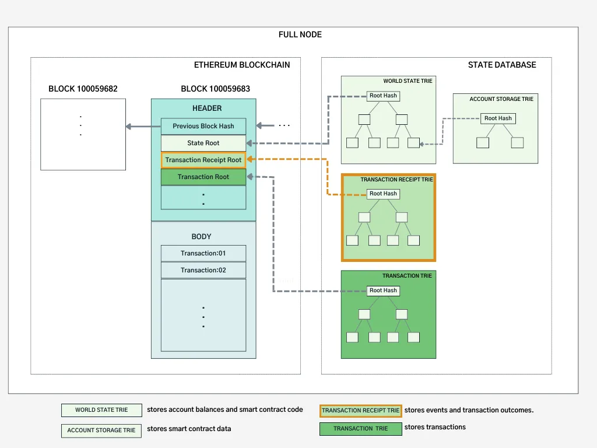
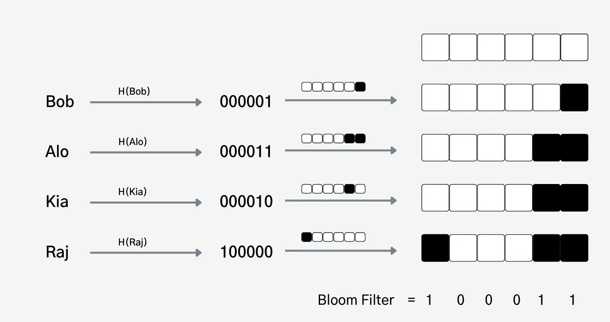
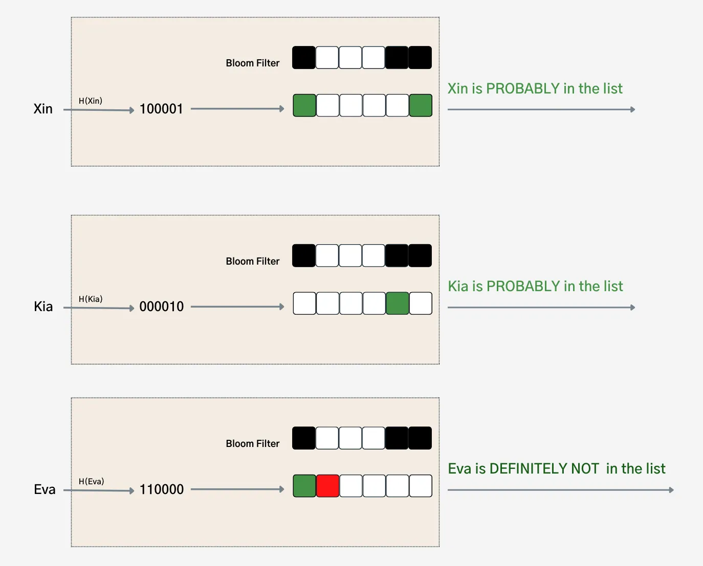

# solidity-basics-workshop

* references
    * https://www.oreilly.com/library/view/hands-on-smart-contract/9781492045250/
    * https://www.amazon.com/Solidity-Programming-Essentials-building-contracts/dp/1803231181
    * https://www.amazon.com/Beginning-Ethereum-Smart-Contracts-Programming/dp/1484292707
    * https://www.springerprofessional.de/en/ethereum-smart-contract-development-in-solidity/18334966
    * https://www.manning.com/books/blockchain-in-action
    * https://www.packtpub.com/product/mastering-blockchain-programming-with-solidity/9781839218262
    * https://www.algoexpert.io/blockchain/index
    * https://chat.openai.com
    * https://www.investopedia.com/terms/b/basic-attention-token.asp
    * https://medium.com/@danielyamagata/understand-evm-opcodes-write-better-smart-contracts-e64f017b619
    * https://ethereum.stackexchange.com/questions/117100/why-do-many-solidity-projects-prefer-importing-specific-names-over-whole-modules
    * https://medium.com/@eiki1212/what-is-ethereum-gas-simple-explanation-2f0ae62ed69c
    * https://ethereum.stackexchange.com/questions/38387/contract-address-transfer-method-gas-cost
    * https://medium.com/@natelapinski/the-difference-between-tx-origin-60737d3b3ab5
    * https://ethereum.stackexchange.com/questions/21448/how-to-get-a-contracts-balance-in-solidity
    * https://medium.com/@blockchain101/solidity-bytecode-and-opcode-basics-672e9b1a88c2
    * https://medium.com/coinmonks/solidity-storage-vs-memory-vs-calldata-8c7e8c38bce
    * https://ethereum.stackexchange.com/questions/123169/can-calldata-be-used-in-every-function-visibility#:~:text=calldata%20can%20typically%20only%20be,call%20it%20with%20calldata%20arguments.
    * https://ethereum.stackexchange.com/questions/74442/when-should-i-use-calldata-and-when-should-i-use-memory
    * https://ethereum.stackexchange.com/questions/117770/how-to-use-calldata-return-values-in-solidity-and-when-are-they-useful
    * https://ethereum.stackexchange.com/questions/64108/whats-the-difference-between-address-and-address-payable
    * https://docs.soliditylang.org/
    * https://medium.com/soonami/3-secure-alternative-methods-to-replace-tx-origin-for-solidity-developers-4acc2c49e1c
    * https://ethereum.stackexchange.com/questions/82240/what-is-the-immutable-keyword-in-solidity
    * https://coinsbench.com/solidity-layout-and-access-of-storage-variables-simply-explained-1ce964d7c738
    * https://consensys.github.io/smart-contract-best-practices/development-recommendations/solidity-specific/assert-require-revert
    * https://stackoverflow.com/questions/71502322/difference-between-assert-and-require
    * https://stackoverflow.com/questions/70216805/why-assertion-is-used-on-this-smart-contract
    * https://ethereum.stackexchange.com/questions/15166/difference-between-require-and-assert-and-the-difference-between-revert-and-thro
    * https://medium.com/coinmonks/error-handling-in-solidity-pt-4-ce2fef14ceb2
    * https://medium.com/@solidity101/writing-robust-smart-contracts-with-require-assert-and-revert-in-solidity-a997f6c9b13f
    * https://medium.com/coinmonks/solidity-fundamentals-a95bb6c8ba2a
    * https://thekscar.medium.com/writing-solidity-unit-tests-for-testing-assert-require-and-revert-conditions-using-truffle-2e182d91a40f
    * https://medium.com/coinmonks/learn-solidity-lesson-26-error-handling-ccf350bc9374
    * https://ethereum.stackexchange.com/questions/131384/is-msg-sender-reliable-in-view-and-pure-functions
    * https://www.alchemy.com/overviews/solidity-gas-optimization
    * https://medium.com/coinmonks/ethereum-data-transaction-receipt-trie-and-logs-simplified-30e3ae8dc3cf

## preface
* goals of this workshop
    * understanding memory model of emv
    * introduction to smart contract
    * basics of Solidity programming
    * introduction to Remix: https://remix.ethereum.org
* workshop task
    * implement event ticketing smart contract
        * `createTicket(qrCode)`
            * `qrCode` is link to IPFS
        * `buyTicket(ticketId)`
        * `verifyTicket(ticketId)`
            * assume that ticketId is derived from `qrCode` by other system 
        * `getQRCode(ticketId)`
    * implement tests in solidity

## memory model
1. storage
    * permanent storage space
        * stored on the blockchain
    * where all state variables are stored
    * each contract account has its own storage and can only access their own storage
        * it is not possible to directly access the storage of another account
        * each Ethereum account has its own unique address and associated storage
            * this address is derived from the account's public key
            * as a result, only the account owner has the private key necessary to access or modify the storage
        * think of storage as a private database
    * thinking of the storage as an array will help us understand it better
        * each space in this storage "array" is called a slot and holds `32` bytes of data (`256 bits`)
        * maximum length of this storage "array" is `2²⁵⁶-1`
        * each slot can be occupied by more than one type
            * unless sum of bytes are <= 32
            * so order matters
        * example
            ```
            // SPDX-License-Identifier: MIT
            pragma solidity ^0.8.16;

            contract StorageLayout {
                uint64 public value1 = 1;
                uint64 public value2 = 2;
                uint64 public value3 = 3; // order matters: you will need 3 slots if value3 and value5 are swapped
                uint64 public value4 = 4;
                uint256 public value5 = 5;
            }
            ```
            and we can get storage at specific slot
            ```
            web3.eth.getStorageAt("0x9168fBa74ADA0EB1DA81b8E9AeB88b083b42eBB4", 0)
            // returns: `0x04000000000000000300000000000000020000000000000001`
            // so we have value1, ..., value4 in one slot
            web3.eth.getStorageAt("0x9168fBa74ADA0EB1DA81b8E9AeB88b083b42eBB4", 1)
            // returns: `0x0000000000000000000000000000000000000000000000000000000000000005`
            ```
        * dynamic arrays and structs always occupy a new slot
            * any variables following them will also be initialized to start a new storage slot
    * it is not cheap in terms of gas - so we need to optimize the use of storage
        ```
        contract storageExample {
        uint256 sumOfArray;

            function inefficientSum(uint256 [] memory _array) public {
                    for(uint256 i; i < _array.length; i++) {
                        sumOfArray += _array[i]; // writing directly to storage
                    }
            }

            function efficientSum(uint256 [] memory _array) public {
               uint256 tempVar;

               for(uint256 i; i < _array.length; i++) {
                        tempVar += _array[i]; // using temporary memory variable
                    }
               sumOfArray = tempVar;
            }
        }
        ```
    * Solidity does not have null values
        * not assigning a value to a state variable = assigning its default value based on the type
        * example
            * `address` -> `0x0000000000000000000000000000000000000000`
            * enums -> assigned the first value (index 0)
1. memory
    * works similarly to the memory of a computer, more specifically, the RAM (Random Access Memory)
        * idea of RAM is that information can be read and stored in specific places
        (at a particular memory address) and not just sequentially
    * short-lived
        * reserved for variables that are defined within the scope of a function
        * gets torn down when a function completes its execution
1. stack
    * works on the LIFO (Last-In First-Out) scheme
    * when the bytecode starts executing, the Stack is empty
    * 1,024 levels deep in the EVM
        * if it stores anything more than this, it raises an exception
1. calldata
    * it is a read-only location
        * example
            ```
            contract Storage {

                string[] messages;

                function retrieve(uint index) public view returns (string calldata){
                    return messages[index]; // not compiling
                }
            }
            ```
            * for it to work: need to copy string to the calldata area
                * impossible: calldata is immutable
            * however: if you already have something in calldata though, you can return it
                * calldata can be returned from functions
        * can typically only be used with functions that have external visibility
            * source of these arguments needs to come from message calldata
            * example: passing forward calldata arguments
    * usually the signature of the function to be executed, followed by the ABI encoding of the function arguments
        * can be verified in Remix, under smart contract method you can "Copy calldata to clipboard"
        * example
            * keccak256 online: https://emn178.github.io/online-tools/keccak_256.html
            * function: `function createTicket(string)`
                * `6897082f779ee6aa6c305e01892e057838143a4691bda17d4092e228fc6d147a`
                * selector: `0x6897082f`
            * argument: `c`
                * `0x63`
                * prepending the data length: `0x0163`
                * we need to zero-pad to a 32-byte word
            * calldata: `concat(selector, packedPaddedArgument)`
    * temporary location where function arguments are stored
    * avoids unnecessary copies and ensures that the data is unaltered
    * helps lower gas consumption
        * compiler can skip ABI encoding
            * the data is already formatted correctly according to the ABI
            * for memory: Solidity would need to encode it before returning
    * calldata is allocated by the caller, while memory is allocated by the callee
* assignments will either result in copies being created, or mere references to the same piece of data
    * between storage and memory/calldata - always create a separate copy
    * from memory to memory
        * create a new copy for value types
        * create references for reference types
            * changing one memory variable alters all other memory variables that refer to the same data
    * from storage to storage
        * assign a reference

## smart contract
* program (bytecode) deployed and executed in the Ethereum Virtual Machine (EVM)
* stored on the Ethereum blockchain
* stores information in blockchain in two distinct ways
    * account storage
        * contains any data that defines the smart contract state and that the contract can access
    * logs
        * store information that is not required by the contract but must be accessed by other off chain applications
            * example: front-end, analytics etc
        * much cheaper than account storage
    * overview
        
    * example: non fungible tokens
        * account storage: token Ownership
            * contract needs it to prove ownership and provide ownership transfer functionality
        * logs
            * token ownership history
                * contract only needs to be aware of current token ownership
                * tracking a token’s ownership history is interest to investors or decision makers
            * UI notifications
                * transactions are asynchronous, the smart contract cannot return value to the front end
                * when the mint occurs, it could write it to the log
                    * front end could then listen for notifications and display them to the user
            * off chain triggers
                * when you want to transfer your token to another blockchain
                    * example: play a game built on a different blockchain
                    * initiate a transfer to a common gateway, and the transaction will log the transfer
                    * common gateway would then pick that information and mint a corresponding token in the other chain
* written in a specific programming language
    * example: Solidity, Vyper
* self-executing with the terms of the agreement written directly into code
    * automate processes
        * Token Sales (ICO)
            * can distribute tokens to contributors based on predefined conditions
    * enforce rules
        * Supply Chain Verification
            * can validate products' authenticity based on information stored
            on the blockchain (e.g., origin, certifications), ensuring compliance with predefined standards
    * facilitate transactions
        * Royalty Payments for Creators
            * when revenue is generated from the sale or use of content (e.g., music, art), the smart
            contract automatically distributes the earnings to the creators according to the agreed-upon terms
* ability to create DApps = Decentralized Application
    * example
        * decentralized exchange (DEX): https://uniswap.org
            * allows users to trade cryptocurrencies directly with one another without the need for
            an intermediary or centralized authority
            * instead of relying on order books (as in traditional exchanges) uses liquidity pools and smart
            contracts to facilitate trading
        * NFT game: https://www.cryptokitties.co
    * application that runs on a decentralized network of computers (usually a blockchain)
        * transactions and data stored in a DApp are recorded on a blockchain
        * not controlled by a single entity
    * components:
        * backend
            * smart contract (open sourced)
            * user's cryptocurrency wallet
                * used to manage and control the user's assets within the DApp
        * frontend: GUI user-facing part of the DApp
            * responsible for communicating with the smart contracts on the blockchain
    * often have their own native tokens or cryptocurrencies
        * used to incentivize network participants and can represent various forms of value
        * example: BAT (Basic Attention Token)
            * system for tracking media consumers' time and attention on websites using the Brave web browser
            * its goal is to efficiently distribute advertising money between advertisers, publishers, and
            readers of online marketing content and ads
    * can operate autonomously without the need for intermediaries

## syntax
* example
    ```
    import 'CommonLibrary.sol';

    pragma solidity ^0.8.9;

    contract FirstContract { }
    ```
* `pragma`
    * generally the first line of code within any Solidity file
    * specifies the target compiler version
    * `^`: contract will compile for any version above the version mentioned but less than the next major version
        * example: `0.8.9` will not work with the `0.9.x` compiler version, but lesser than it
    * good practice: compile Solidity code with an exact compiler version rather than using ^
* `import`
    * example
        ```
        import {
            ERC721HolderUpgradeable // way to avoid naming conflicts
        } from "@openzeppelin/contracts-upgradeable/token/ERC721/utils/ERC721HolderUpgradeable.sol";
        ```
    * are for your development environment only
        * when you deploy your contracts on the Ethereum blockchain, import statements must be replaced with the actual content of the `.sol` file that you imported
        * Ethereum blockchain takes the flattened files of the smart contract and deploys it
            * content of the imported contract is effectively copied and pasted into the current contract during the compilation process
            * this means that all elements defined in the imported contract become part of the current contract
        * framework, such as Truffle or the Remix IDE, converts all import statements and makes a single flattened contract during deployment
* constructors
    * are optional and the compiler induces a default constructor when none is explicitly defined
    * executed once while deploying the contract
    * can have a payable attribute
        * enable it to accept Ether during deployment and contract instance creation time
    * can be defined as internal
        * contract cannot be deployed
* two ways of creating a contract
    * using the new keyword
        * deploys and creates a new contract instance
            * when we deploy the contract, we simply deploy compiled hexadecimals under the data field
                * example
                    ```
                    pragma solidity ^0.8.21;

                    contract MyContract {

                    }
                    ```
                    is compiled to
                    ```
                    0x6080604052348015600e575f80fd5b50603e80601a5f395ff3fe60806040525f80fdfea2646970667358221220e48937f3cf7fd35ec1550eb34b94a85d69119e8fe5c9a996d43a65140f5ce75964736f6c63430008150033
                    ```
        * example: `HelloWorld myObj = new HelloWorld();`
    * using the address of the already-deployed contract
        * is used when a contract is already deployed and instantiated
        * example: `HelloWorld myObj = HelloWorld(address);`
* this
    * represents the current contract
    * use case: get balance of current contract
        ```
        address(this).balance
        ```
* inheritance
    * C3 linearization / Method Resolution Order (MRO) (similar to Python)
        * force a specific order in graphs of base contracts
    * contract becomes an abstract contract when it consists of functions without any implementation
        * you cannot create an instance of an abstract contract.
    * interfaces cannot contain any definitions and any state variables
        * only the signature of functions
* types
    * bool
    * uint/int8...256
        * example: uint8 - unsigned integer with 8 bits (ranging from 0 to 255)
        * uint/int - alias for uint256/int256
        * signed integers - hold both negative and positive values
        * unsigned integers - hold positive values along with zero
    * arrays
        * fixed arrays
            ```
            int[5] age = [int(10), 20, 30, 40, 50];

            age[0]; // retrieve
            ```
            * slot storage
                * stored contiguously
        * dynamic arrays
            ```
            int[] age = [int(10), 20, 30, 40, 50];
            int[] age = new int[](5);

            age.push(60); // add
            age.pop(); // remove
            age[0]; // retrieve
            ```
            * slot storage
                * in the slot: only its length is saved
                    * its elements stored somewhere else in the storage
                * example
                    ```
                    uint256[] public values = [1,2,3,4,5,6,7,8];
                    uint constant slot = 0
                    uint constant startingIndexOfValues = keccak256(abi.encode(slot))

                    function getElementIndexInStorage(uint256 _elementIndex) public pure returns(bytes32) {
                        return bytes32(uint256(startingIndexOfValues) + _elementIndex);
                    }
                    ```
                * elements are stored sequentially from the hash
                    * space layout applies to them
                    * example: many elements of `uint8[]` would fit in a single slot until 32 bytes are occupied
                * indices are huge and look random
                    * keccak256 returns a 256 bit number
                    * storage capacity is 2²⁵⁶-1 elements
                        * we are good and in range using keccak256 hash as slot index
                    * makes the probability of 2 or more different state variables sharing the same slot in storage low
    * bytes
        * bytes1 to bytes32 inclusive
        * fixed-size byte array
        * example
            ```
            function test() public pure returns (bytes1) {
                bytes2 arr = 0x1234;
                bytes1 first = arr[0]; // 0x12
                bytes1 second = arr[0]; // 0x34
                return first;
            }
            ```
    * String
        * do not provide string manipulation methods
            * no access by indexed
            * no push
            * no length property
            * to perform any of these - convert into bytes
                ```
                bytes byteName = bytes(name);
                ```
            * no equals
                ```
                Keccak256(''hello world'') == keccak256(''hello world'') // check for equality
                ```
        * slot storage
            * same as fixed arrays
    * Bytes
        * similar to dynamic arrays
    * address
        * one of the most used data types in smart contracts
        * provides three functions
            * call
            * delegatecall
            * callcode
            * described here: https://github.com/mtumilowicz/solidity-upgradable-contract-proxy-workshop
        * single property: balance
        * designed to hold account addresses in Ethereum
            * 160 bits or 20 bytes in size
        * cannot be used to send or receive Ethers
            * can be converted to `payable address`
                ```
                address addr1 = msg.sender;
                address payable addr3 = payable(addr1);
                ```
        * payable
            * superset of the address type
                * idea behind this distinction: you are not supposed to send Ether to a plain address
                    * example: it might be a smart contract that was not built to accept Ether
            * additional capability of receiving as well as sending Ether to other accounts
            * additional methods used to send ether to a contract or an externally owned account
                * transfer/send()
                    * provides 2,300 units of gas as a fixed limit (cannot be superseded)
                        * currently only enough to log an event
                    * low-level functions and should be used with caution
                        * if used with the contract address, it will invoke a fallback or receive function on the contract
                            * may recursively call back within the calling contract again and again (reentrancy attack)
                    * `send()` function returns Boolean
                    * `transfer()` raises an exception in the case of execution failure
                        * all changes are reverted
                        * better alternative to `send()`
    * mapping
        * similar to hash tables or dictionaries in other languages
        * example
            ```
            mapping(address => uint256) public balances;

            function setBalance(address _address, uint256 _balance) public {
                balances[_address] = _balance;
            }

            function getBalance(address _address) public view returns (uint256) {
                return balances[_address];
            }
            ```
        * only as a storage type
            * not stored sequentially as arrays
                * there is no way to order them to save space by fitting smaller types into a single slot
            * slot where the mapping is declared does not contain any information
                * just empty bytes
            * example
                ```
                mapping(address => uint256) public balances;
                ```
                and we need to know storage index of the `0x6827b8f6cc60497d9bf5210d602C0EcaFDF7C405`
                1. left pad the address to 32 bytes
                1. left pad the mapping index
                    * our mapping is declared at index 0 of the storage
                1. concatenate them and calculate the keccak256 hash for it
        * Solidity does not allow iteration through mapping
            * `OpenZeppelin` provides `EnumerableMap` that allows you to create an iterable mapping in Solidity
        * possible to have nested mapping
    * enum
        * example
            ```
            enum Status { Inactive, Active, Paused }

            function getStatus() public pure returns (Status) {
                return Status.Active;
            }
            ```
        * values are not directly visible outside the contract
            * each enum value is assigned a unique consecutive integer value starting from 0
            * if you externally call `getStatus()` you will get int: `1`
    * struct
        * help implement custom user-defined data types
        * do not contain any logic within them
        * slot storage
            * slot index where it is declared is reserved for the first value it has
                * and then sequentially
                * example
                    ```
                    Person public p = Person(1, "Jeremy", 28, true);
                    ```
                    * id - slot index 0, name - slot index 1 and so on
* global variables
    * information about the current transaction and blocks
    * `msg`
        * `msg.value`
            * amount of Ether (in wei) sent with the current transaction
        * `msg.gas`
            * amount of gas remaining in the current transaction
        * `msg.data`
            * contains the complete calldata
            * data payload of the transaction
            * contains the function selector and any input data provided when a function is called
                * when contract is deployed, constructor selector is used
        * `msg.sig`
            * first four bytes of the `msg.data` (function selector)
                * all of the public and external functions have special members available, called selector
                    * returns the first 4 bytes of the function signature as bytes4
                    * example
                        ```
                        function add(uint256 a, uint256 b) public pure returns (uint256);

                        bytes4 functionSelector = bytes4(keccak256("add(uint256,uint256)"));

                        bytes4 functionSelector = this.add.selector;
                        ```
            * helps to optimize gas usage by directly specifying the function to be executed
                * rather than parsing `msg.data` manually
        * `msg.sender`
            * represents the address that is currently calling or interacting with the smart contract
    * `tx.origin`
        * address of the original sender of the transaction
            * EOA that initiated the transaction
            * EOAs are the only things in Ethereum that could create a transaction
                * can change with ERC-4337 (account abstraction), whereby certain smart contracts will have the
                ability to issue transactions on behalf of a user
        * `msg.sender` is not always equal to `tx.origin`
            * smart contract can call other smart contracts as part of the same transaction
            * each time a contract calls another contract, the value of `msg.sender` is updated
    * `block.timestamp`
        * timestamp of the current block as a Unix timestamp
* cryptographic functions for hashing values
    * SHA2 (sha256)
    * SHA3 (sha3 or keccak256 function)
        * recommended to use the keccak256 function for hashing needs
            * is specified in the Ethereum Yellow Paper
            * using sha256 could potentially lead to confusion and compatibility issues
* qualifiers
    * state variables
        * internal
            * default
            * can only be used within current contract functions and any contract that inherits from it
            * cannot be directly accessed by external contracts or external actors, its value is still
            stored on the blockchain and can be observed by inspecting the blockchain's state
        * private
            * can only be used in contracts containing them
            * cannot be directly accessed by external contracts or external actors, its value is still
            stored on the blockchain and can be observed by inspecting the blockchain's state
        * public
            * enables external access to state variables
            * Solidity compiler generates a getter function for each public state variable
            * cannot be directly modified from an externally owned account (EOA) - you need a setter method
        * constant
            * makes state variables immutable
            * the compiler will replace references of this variable everywhere in code with the assigned value
            * does not occupy storage on the blockchain
        * immutable
            * can only be assigned once
            * read-only, but assignable in the constructor
            * less restricted than those declared as constant
    * functions
        * internal - same as for state
        * public - same as for state
        * private - same as for state
        * external
            * can only be invoked by other contracts or externally owned accounts (EOAs)
            * become part of the contract's interface
            * helps to enforce security and transparency in your contract design
        * additional qualifiers
            * view
                * not modify the state of the contract
                    * state changing actions
                        * writing to state variables
                        * emitting events
                        * creating other contracts
                        * using selfdestruct
                        * sending ether via send and transfer
                        * calling any function not marked view or pure
                        * using low-level calls
                        * using inline assembly that contains certain opcodes
                * read-only
                * view functions are accessible both off-chain and on-chain
                    * on-chain
                        * consumes gas
                        * example: if function that changes the contract state calls a view function
                    * off-chain
                        * doesn't consume any gas
            * pure
                * more restrictive than `view`
                    * cannot access state variables
            * no way to fully trust `msg.sender` in a view or pure function
                * signatures are not verified in simple calls
                * one way to fully assure yourself of who is calling a function: to have the caller sign and message
                and then use `ecrecover` to derive address from signature
            * payable
                * function can accept Ether only if marked as payable
* modifiers
    * is always associated with a function
    * refers to a construct that changes the behavior of code under execution
    * it has the power to change the behavior of functions that it is associated with
    * is similar to the decorator pattern in object-oriented programming
    * example
        ```
        modifier onlyOwner() {
            require(msg.sender == owner, "Only the owner can call this function");
            _; // This is a placeholder for the actual function code
        }

        function setData(uint256 _value) public onlyOwner {
            data = _value;
        }
        ```
* events
    * transactions can generate events
    * used to notify external systems about specific state changes
        * example
            ```
            event Transfer(address indexed from, address indexed to, uint256 indexed tokenId);

            function transferNFT(address from, address to, uint256 tokenId) external {
                require(_isApprovedOrOwner(msg.sender, tokenId), "Not authorized");
                _safeTransfer(from, to, tokenId, "");

                emit Transfer(from, to, tokenId);
            }
            ```
    * stored in a special data structure called the "logs bloom"
        * compact representation of all events emitted in a block
        * allows nodes to quickly check if a log is included in a block, without having to go through the full log data
        * smart contracts cannot hear events on their own because
            * contract data lives in the States trie
            * event data is stored in the Transaction Receipts trie
        * digression: bloom filters
            * problem: we want to find out if a user exists in a given list
            * naive solution: go through the list
                * if a list contains thousands of users, it becomes prohibitively expensive and extremely slow
            * probabilistic solution: hashing and mapping each user in the list
                
                
            * is a probabilistic data structure that can either say “probably present” or “definitely not present”
            * is extremely useful, especially when you expect the majority of the answers to be DEFINITELY NOT
        * EVM combines the logs bloom of each transaction and creates a logs bloom in the header
            * assume we have to search for the same query (tokens sold by a specific user) but across many blocks
                * instead of querying the bloom of every transaction in every block, we can simply query the bloom at the header
    * up to four indexed parameters (topics)
        * used to filter events when querying the blockchain
        * first topic is used to log the signature of the event
            * the first four bytes of the keccak256 hash of the event's signature
* error handling
    * supports try-catch
    * possibility to define error objects
        * example
            ```
            error InsufficientBalance(uint available, uint required);
            ```
        * cannot be used in conjunction with the require function
            * must be used in conjunction with the revert function
    * revert
        * example
            ```
            if (balanceOf[msg.sender] <= 100) {
                revert InsufficientBalance(balanceOf[msg.sender], 100);
            }
            ```
        * use case
            * if it is hard to use `require`
                * example: complex ifs structures
    * require
        * using `if (!condition) revert(...)` and `require(condition, ...)` have the same effect
        * example
            ```
            require(msg.value >= price, "Insufficient Ether sent");
            ```
        * accepts two arguments
            * condition that either evaluates to true or false
            * optional error message
                * string value that is returned to the caller as part of the exception reason
                * returns an exception of the Error(string)
        * if the evaluation of the statement is false then
            * compiles to `0xfd` which is the `REVERT` opcode
            * an exception is raised and execution is halted
            * unused gas is returned to the caller
                * does not return already-consumed gas
                * should be used at the beginning of the function
            * state change is reversed
                * even if storage variables is made prior to the require statement (within a function)
        * use cases - validations
            * inputs
            * return values
            * calls to external contracts
            * condition before state update
        * correspond to function preconditions in other programming languages
    * assert
        * used to check for conditions that should never be false
        * can't provide a message error
        * use case
            * test for internal errors
                * example: checking the balance of an account after an operation
            * check invariants
                * example: the token to ether issuance ratio, in a token issuance contract, may be fixed
                    * verify that this is the case at all times
            * when you think that a current state has the potential to become inconsistent
                * example: OpenZeppelin’s
                    * SafeMath.add() function asserts that any summed integers do not overflow
            * documenting your assumptions with assertions
            * commonly employed during the development and testing stages to catch and identify bugs
        * if the evaluation of the statement is false then
            * compiles to `0xfd` which is the `REVERT` opcode
                * uses revert with error signature Panic(uint256)
                * till version 0.8.0
                    * assert(false) compiled to `0xfe` - invalid opcode
                        * using up all remaining gas
                        * reverting all changes
                * digression
                    * non-critical errors revert either with empty error data or Error(string)
                        * example: division by zero, failing assertions, array access out of bounds
                    * critical errors revert with Panic(uint256)
        * should often be combined with other techniques, such as pausing the contract and allowing upgrades
            * otherwise, you may end up stuck, with an assertion that is always failing
        * way to provide a target for formal verification
            * example: tools such as the SMTChecker can detect bugs by trying to prove various statements about your code
                * based on SMT (Satisfiability Modulo Theories) and Horn solving
                * it considers require statements as assumptions and tries to prove that the conditions inside assert statements are always true
                * if an assertion failure is found, a counterexample may be given to the user showing how the assertion can be violated
                * if no warning is given by for a property, it means that the property is safe
